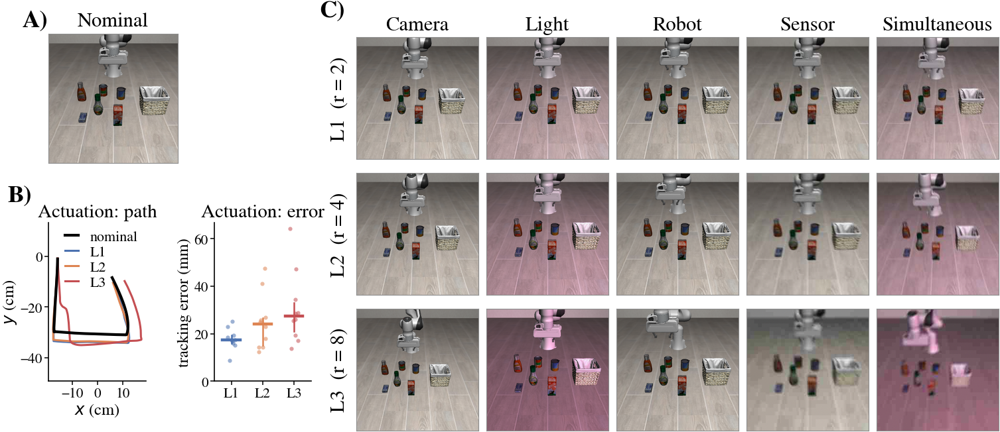
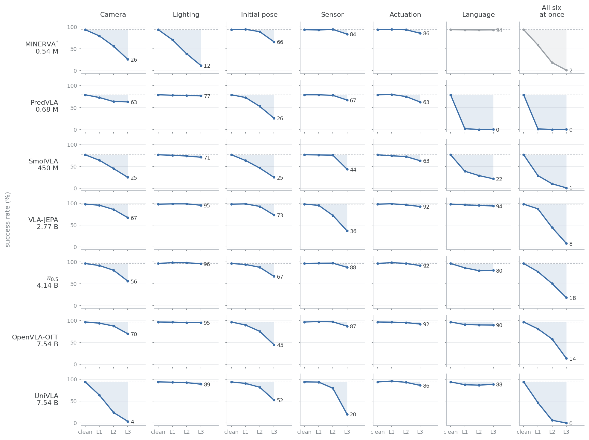

# LIBERO-CTRL

A severity-calibrated, paired, controlled robustness benchmark for vision-language-action
policies, built on top of [LIBERO](https://github.com/Lifelong-Robot-Learning/LIBERO).

This repository holds the material behind the paper: the raw per-rollout record of every number it
reports, and the code that turns those records back into its tables and figures.

## Reproducing the paper

```bash
make verify      # re-derive every number the paper states, from the raw records
make paper       # regenerate the tables and figures into analysis/out/
```

Both read only the JSONL records in `results/paper/` — **162,098 rollouts across 72 runs, 34 MB.**
No GPU, no simulator, no checkpoint and no download: Python 3.10 or newer with `numpy` and
`matplotlib` is the whole dependency list. Measured here: `make paper` 23 s, `make verify` 2 min.

| target | writes | in the paper |
|---|---|---|
| `make paper` | `analysis/out/summary.{json,md}` | `tab:axes` — success rate and `n` per policy × axis × level, per suite as well |
| | `analysis/out/tab_decomp.tex` | `tab:decomp` — the three-term decomposition, typeset |
| | `analysis/out/policy_profiles.{pdf,png}` | the per-policy axis profiles |
| | `analysis/out/composition.{pdf,png}` | the composition figure |
| | `docs/figs/axis_grid.{png,pdf}` | the grid below |
| `make verify` | stdout, plus `analysis/out/manuscript_numbers.json` | every quoted number in Section 4 |

`make verify` runs six checks in order: the nominal scores against the published aggregates, the
decomposition with its cluster bootstrap, the emergent/compensated split, the single-axis
re-collection, the 60-rollout repeat diagnostics, and the 25,200-rollout independent re-collection
that bounds how far the superposition effect `I` moves when three sampling policies are run again.

`docs/RESULTS_INDEX.md` says what every run directory is and how the two collection machines were
merged; `docs/RUNS.md` gives the exact command behind each one.

### Re-collecting the rollouts instead of reading them

`setup/` takes a policy from nothing to a scored run in one command — it clones the upstream code
at the revision used here, builds that policy's environment, downloads its checkpoint, starts its
server and runs the benchmark:

```bash
bash setup/ctrl.sh    install        # once: LIBERO + robosuite + this package
bash setup/lerobot.sh pi05 install
bash setup/lerobot.sh pi05 gate      # 2,000 nominal rollouts, checked against the published score
bash setup/lerobot.sh pi05 eval      # the 8,400 perturbed rollouts
```

Six of the seven policies are covered; the seventh is not publicly distributed. The measured cost
on a single GPU is 2.5 to 54 hours for a nominal run and 13 to 294 for a perturbed one, per policy
— `setup/README.md` has the per-policy table. That is what the 34 MB of records buys you.

## What is being measured



Seven axes — camera, lighting, robot initial pose, sensor, actuation, language, and all six at
once — at three severity levels that are *equidistant by construction*: severity is the Euclidean
radius `‖Δp/σ‖₂` in a parameter space normalised by per-parameter scales `σ` calibrated once,
offline (`calibration/calibration.json`), and L1, L2 and L3 are radii 2, 4 and 8. A camera L2 and
a lighting L2 are therefore the same distance from nominal, and within a level the ten
configurations are *directions* on that sphere.

Every rollout is **paired**: same task, same initial state, same policy seed, with and without the
perturbation. The decomposition of Section 4 needs that pairing and cannot be computed from
unpaired scores.

**(A)** the nominal observation. **(B)** actuation, the one axis that changes no pixel, measured in
the simulator: the end-effector path one fixed command sequence produces at each level, and the
tracking error that opens up. **(C)** the five axes that do change the image.
`libero_object` task 2, initial state 23, configuration 0 — *pick up the salad dressing and place
it in the basket*. `docs/PERTURBATIONS.md` gives every parameter value.

## What the numbers say



Seven policies, 0.54 M to 7.54 B parameters, 2,000 nominal plus 8,400 perturbed rollouts each,
`n = 400` per cell. The dashed line is that policy's own nominal score and the shaded area is what
the axis takes away from it. The smallest policy's two rightmost cells are n/a: it resolves the
instruction to an index in a fixed 40-task table, so a paraphrase is not an admissible input, its
language axis is the identity, and neither cell measures what its column says.

- **Which axis hurts most is not shared.** UniVLA keeps 3.8% under camera L3 but 88.8% under
  lighting L3; MINERVA is the other way round — lighting takes it from 93.9% to 12.0% while camera
  leaves 26.0%. OpenVLA-OFT's worst single axis at L3 is the robot initial pose (44.8%), not
  camera (69.8%). A single robustness score hides all of this, and so does any benchmark that
  perturbs one thing.
- **The language axis separates policies more sharply than any visual axis, and not by scale.** At
  L3 the loss relative to a policy's own nominal score runs from 4.1 points (2.77 B) to 54.8
  (450 M) and 79.0 (0.68 M), with paraphrases that preserve every content word. It is also
  approximately binary: only SmolVLA degrades monotonically across L1–L3; the others take their
  whole loss at L1 and are then flat (OpenVLA-OFT reads 90.8 / 90.0 / 89.8). A severity scale
  calibrated on geometry and photometry does not transfer to text.
- **The conventional compositionality residual conflates three things.** Six axes each at radius
  `r` sit at `√6·r` in the joint space, so the simultaneous condition at L1 is already a longer
  displacement than any single axis at L3, and at L3 no policy exceeds 18.2%. Decomposing
  `S_sim − S_prod` into nominal-score normalisation `B`, cross-axis survival dependence `D` and
  the superposition effect `I` shows that `B` is the largest of the three in nine of the fifteen
  resolvable cells, that `D > 0` everywhere it resolves — the states that fail under one axis are
  disproportionately those that fail under another — and that the residual's sign is not the
  interaction's sign. OpenVLA-OFT at L1 reads as perfectly compositional (residual −0.8) and
  decomposes into −12.6 + 4.6 + 7.3, with `I = +7.3` points, `p = 0.004`; VLA-JEPA at L1 reads as
  clearly negative (−6.3) and decomposes into −10.7 + 5.4 − 1.0, with `I` indistinguishable from
  zero. The conventional metric errs in both directions, and which direction cannot be inferred
  from its value.

<details>
<summary><b>The same grid as a table</b></summary>

See `analysis/out/summary.md` after `make paper` for the generated version, including per-suite
breakdowns and the counts behind every cell.

</details>

## Layout

```
results/paper/      the raw per-rollout records behind every number in the paper
analysis/           the tables, figures and statistics, regenerated from those records
manifests/v0.1/     the experiment design: one JSON line per rollout
calibration/        calibration.json: the σ that define the severity metric
libero_ctrl/        the package: the env wrapper, the six perturbations, the CLI
setup/              one command per policy: upstream code, environment, checkpoint, gate
examples/           the three entry levels, plus the policy servers used for the paper
docs/               protocol, calibration, what a perturbation looks like, policies, run commands
```

## License

MIT, see `LICENSE`. LIBERO and robosuite, which this builds on, are MIT-licensed as well.
