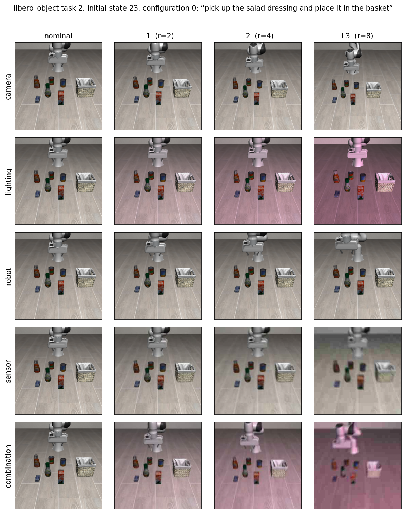

# What a perturbation looks like

One task, one initial state, one configuration index — `libero_object` task 2,
initial state 23, configuration 0:

> *pick up the salad dressing and place it in the basket*



Severity is the Euclidean radius `‖Δp/σ‖₂` in a parameter space normalised by the
per-parameter scales in `calibration/calibration.json`. L1, L2 and L3 are radii 2, 4 and 8,
so a camera L2 and a lighting L2 are the same distance from nominal and the grid reads
across as well as down. Within a level the ten configurations are *directions* on that
sphere; configuration 0 is shown here, and a different configuration moves the same
distance a different way.

Two of the seven axes do not change the image and are therefore absent from the figure.
`actuation` transforms the action on its way to the controller, and `language` replaces
the instruction. Both are given in full below.

---

### camera — the agentview camera moves on a sphere about its look-at point

| parameter | L1 | L2 | L3 | unit |
|---|---:|---:|---:|---|
| `d_azimuth_deg` | +0.064 | +0.128 | +0.256 | deg |
| `d_elevation_deg` | +0.807 | +1.614 | +3.228 | deg |
| `d_distance_m` | +0.073 | +0.146 | +0.292 | m |
| `d_lookat_x_m` | -0.015 | -0.030 | -0.060 | m |
| `d_lookat_y_m` | +0.019 | +0.038 | +0.077 | m |

### lighting — intensity, colour, ambient level and source elevation

| parameter | L1 | L2 | L3 | unit |
|---|---:|---:|---:|---|
| `d_intensity_ev` | +0.005 | +0.009 | +0.018 | EV |
| `d_log2_warm` | +0.032 | +0.063 | +0.127 | log2 R/B |
| `d_tint_g` | -0.114 | -0.228 | -0.457 | log2 G |
| `d_log2_ambient` | -0.192 | -0.383 | -0.766 | log2 |
| `d_elevation_deg` | +10.815 | +21.631 | +43.262 | deg |

### robot — the initial end-effector pose, solved by damped least-squares IK

| parameter | L1 | L2 | L3 | unit |
|---|---:|---:|---:|---|
| `eef_dx_m` | +0.036 | +0.071 | +0.143 | m |
| `eef_dy_m` | -0.030 | -0.060 | -0.120 | m |
| `eef_dz_m` | +0.019 | +0.038 | +0.075 | m |
| `eef_rx_deg` | -0.703 | -1.407 | -2.813 | deg |
| `eef_ry_deg` | +1.496 | +2.993 | +5.985 | deg |
| `eef_rz_deg` | +0.104 | +0.208 | +0.416 | deg |
| **‖translation‖** | **50** | **101** | **201** | mm |

### sensor — degradation applied to the rendered observation

| parameter | L1 | L2 | L3 | unit |
|---|---:|---:|---:|---|
| `noise_sigma` | -0.000 | -0.001 | -0.001 | pixel, [0,1] |
| `blur_sigma` | -0.129 | -0.257 | -0.515 | px @128 |
| `jpeg_log2` | +0.635 | +1.269 | +2.538 | quality = 100·2^-d |
| `motion_len` | -0.886 | -1.772 | -3.545 | px @128 |

### actuation — systematic error between the commanded and the executed motion

| parameter | L1 | L2 | L3 | unit |
|---|---:|---:|---:|---|
| `gain_log2` | -0.000 | -0.001 | -0.002 | log2 scale |
| `bias_frac` | -0.004 | -0.008 | -0.015 | fraction of demo RMS |
| `misalign_deg` | +1.354 | +2.707 | +5.414 | deg |
| `lag_tau` | -0.379 | -0.758 | -1.516 | control steps |
| `noise_frac` | +0.007 | +0.015 | +0.029 | fraction of demo RMS |

### language — the instruction itself is replaced

| level | instruction |
|---|---|
| nominal | pick up the salad dressing and place it in the basket |
| L1 | pick up the salad dressing and place it into the basket |
| L2 | pick up the salad dressing and put it into the basket |
| L3 | find the salad dressing, pick it up, and then place it into the basket |

### combination — all six axes applied at once

Configuration *j* of the combination axis bundles configuration *j* of every axis, which
is why the bottom row of the figure is the superposition of the five rows above it plus
the paraphrase. Six axes each at radius *r* sit at `√6·r` in the joint space, so
combination L1 is already a longer displacement than any single-axis L3.

---

Regenerate this figure, for any task and configuration, with

```bash
python analysis/fig_perturbation_grid.py --suite libero_object --task 2 --config 0
```
